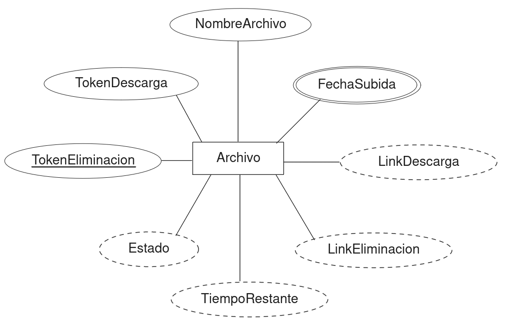

# Requerimientos

Existe un servicio de almacenamiento temporal en la nube llamado [transfer.sh](https://transfer.sh)  donde se pueden subir archivos de hasta 10 GB totalmente gratis, los archivos subidos se eliminarán en 14 días, para eliminar los archivos se necesita un token de eliminación.

El enlace de descarga se compone de la siguiente manera

https://transfer.sh/6HpgbM0cRQ/find.class

Donde

https://transfer.sh/{tokenDescarga}/{nombreArchivo}

Se necesita llevar un registro de:

- Nombre del archivo.
- Token de descarga.
- Token de eliminación.
- Link de descarga.
- Link de eliminación.
- Fecha y hora en la que se subió (con formato de 24 horas).
- Tiempo restante antes de que expire.
- Su estado actual (disponible, expirado, eliminado).

# Diccionario de Datos

Atributo         | Tipo de Dato | Longitud | Derivado | Nulo | Compuesto | Polivalente
-----------------|--------------|----------|----------|------|-----------|-------------
Nombre           | String       | 40       | No       | No   | No        | No
TokenDescarga    | String       | 11       | No       | No   | No        | No
TokenEliminacion | String       | 21       | No       | No   | No        | No
Estado           | String       | 10       | Si       | No   | No        | No
LinkSubida       | String       | 150      | Si       | No   | No        | No
LinkEliminacion  | String       | 150      | Si       | No   | No        | No
FechaSubida      | -            | -        | No       | No   | Si        | No
TiempoRestante   | int          | -        | Si       | No   | No        | No

## Restricciones

- La fecha de subida se compone de día, mes, año, hora, minuto, segundo.
- El estado tiene tres valores posibles: Eliminado, Expirado, Disponible. Se pueden inferir al visitar en enlace o comprobando la fecha de subida.
- LinkSubida se puede inferir con el TokenDescarga.
- LinkEliminacion se puede inferir con el TokenEliminacion.
- TiempoRestante se puede inferir con la FechaSubida. 
- En subidas de archivos múltiples, el TokenDescarga es el mismo.

# Diagrama Entidad Relación

 

# Esquema Relacional

Archivo(**TokenEliminacion**, Nombre, TokenDescarga, Dia, Mes, Año, Hora, Minuto, Segundo)

**Archivo**

**TokenEliminacion** | Nombre     | TokenDescarga | Dia | Mes | Año  | Hora | Minuto | Segundo
---------------------|------------|---------------|-----|-----|------|------|--------|---------
ADcTVRfE9x0trUxOHjKH | find.class | 6HpgbM0cRQ    | 15  | 10  | 2023 | 17   | 34     | 10
BulRBGwpIiIEYcLrWu4a | ls.java    | 6HpgbM0cRQ    | 15  | 10  | 2023 | 17   | 34     | 10
1G2UU3jPNVTCIpGdGfr8 | find.class | dlvKkPi8I0    | 15  | 10  | 2023 | 17   | 34     | 10

<!-- #Duda: Cumple las formas normales? -->
